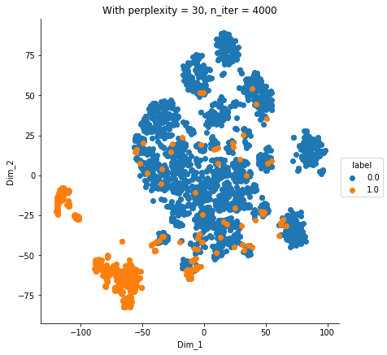
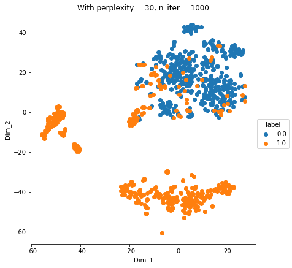

# t-SNE (Dimensionality Reduction) Plot on CreditCard DataSet. KaggleDataSet
  
## Kaggle Data Set - Credit Card Fraud
### The datasets contains transactions made by credit cards in September 2013 by european cardholders. 
## Dataset Information:
    * Number of Instances: 284,807
    * Number of Attributes: 31 (including the class attribute)
    * Attribute Information:
    * Features V1, V2, ... V28 are the principal components obtained with PCA.    
    * The only features which have not been transformed with PCA are 'Time' and 'Amount'.
    * Feature 'Time' contains the seconds elapsed between each transaction and the first 
      transaction in the   dataset.
### Class (class attribute):
    * Feature 'Class' is the response variable and it takes value 1 in case of fraud and 0 
      otherwise. 
      1 = Fraud Transaction
      0 = Normal Transaction
### All the remaining details regarding the data set can be found in the below link.
### [CreditCardFraud](https://www.kaggle.com/mlg-ulb/creditcardfraud/data)

### Analysis:

As t-SNE takes lot of time for 28k transactions i under-sampled unbalanced dataset to nearly balanced dataset and perfectly balanced dataset.

  * UnderSampling the unbalanced DataSet and applied t-SNE on Credit CardDataSet by varying hyper-parameters of t-SNE.
     Identified fraud transactions can be separated from  normal transactions more or less.
     Detailed report can be found at TsnePlotOnCreditCard.pdf
     
  ####   t-SNE results on Nearly Imbalanced dataSet.
     
     
     
     
     
       
  ####   t-SNE results on Perfectly balanced dataSet.
       
       
          
       
     
     
     
